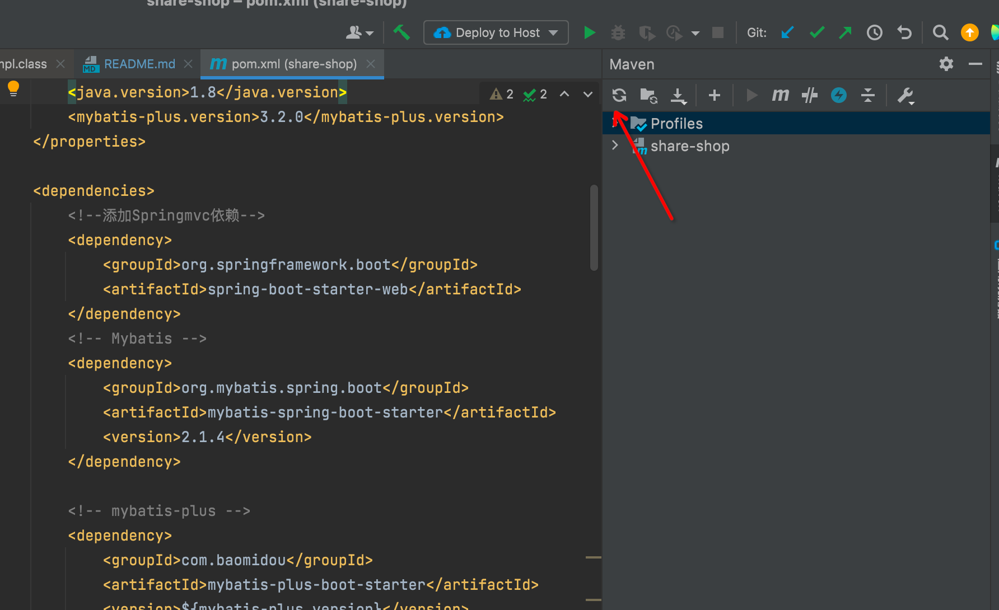

#### 🛫 介绍
脚手架工程改造而来，参考[x-admin](https://gitee.com/xqnode/x-admin.git)项目，原因么？有部分低代码的东西，可以简化不少东西。

#### 👑 核心功能
自动生成代码，可以根据数据库表自动生成后台增删改查接口和前台的html代码，不用写代码就能做出一个管理系统！

目前系统可以根据后台数据库的特定字段自动生成 `文本框`、 `下拉框（带数据关联）`、`日期控件（日期和日期时间控件）`、`单选按钮`、`文件上传（表格可直接显示图片）`等，方便舒适。

#### 🚂 软件架构
Java后台：SpringBoot 2.1.0 + Mybatis-plus+ hutool工具包 + Apache poi

前台页面：Vue2.0 + ElementUI + Jquery + tinymce（富文本插件）

数据库：Mysql5.7+

**注意：JDK选择`1.8`版本，Mysql选择`5.7`版本**

前后端分离，页面可单独部署，默认放在项目的static文件夹，随后端工程一起访问。

#### 🚁 安装教程

1. 使用git下载本项目

    `https://github.com/jianhui1012/shop-data`

2. 使用idea打开shop-data文件夹导入工程

3. 配置maven，下载项目依赖
   
   
   
4. 新建数据库
   
5. 修改application.yml中的数据库密码
   
6. 项目依赖下载完成后，直接运行 Application 启动SpringBoot即可
   
7. 运行效果
...
